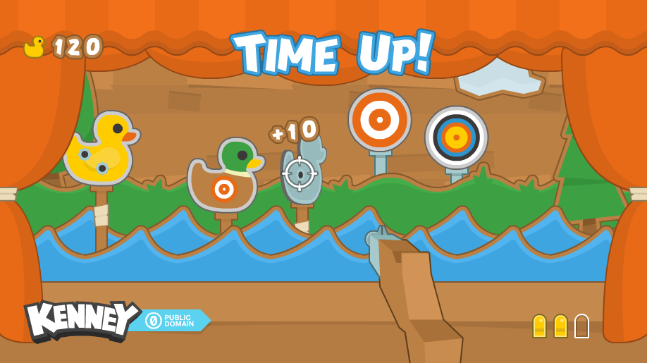

# Sviluppo di videogiochi 2D in Go

In questo repository è possibile trovare il materiale di supporto al webinar di
[Develer](https://www.develer.com/) che ho tenuto il 18/11/2020:
[Sviluppo di videogiochi 2D in Go](https://www.develer.com/eventi/sviluppare-videogiochi-2d-in-go/)

Il webinar era rivolto a programmatori Go alle prime armi con la voglia di esplorare il linguaggio
senza seguire le solite guide per la realizzazione del classico "ToDo", ma con qualcosa di diverso.
In questo caso la scrittura di un gioco 2D utilizzando la [libreria Ebiten](https://ebiten.org/).

Le slide presentate durante il webinar sono [qui](./Slides.pdf)

## Il contenuto del repository

### Assets

La cartella [./assets](./assets) contiene tutto il materiale richiesto per la realizzazione
del gioco di esempio (i 3 esercizi proposti): immagini, suoni, font.

Le immagini sono presenti sia come file singoli (in [./assets/PNG/](./assets/PNG/)) o raggruppate
in spritesheet. Ogni spritesheet è accompagnato da un file JSON con la posizione di ogni immagine
al suo interno e il suo nome.  
Il nome può essere utilizzato, guardando i nomi delle immagini singole, per ritrovare l'immagine
cercata nello sprite.

Le immagini fanno parte del pacchetto [Kenney Shooting](https://www.kenney.nl/assets/shooting-gallery).

### Esempi

La cartella [./examples](./examples) contiene tutti gli esempi presentati durante il webinar.

### Shooter game

La cartella [./shooter-game](./shooter-game) contiene la mia versione degli esercizi proposti
durante il webinar.

Dato che nella cartella c'è la versione completa del gioco, non conviene guardarla mentre si
prova a fare gli esercizi. Conviene invece guardare gli stadi intermedi di sviluppo, che sono
opportunamente taggati:

* [primo esercizio](https://github.com/develersrl/webinar-go-game-development/tree/shooter-1)
* [secondo esercizio](https://github.com/develersrl/webinar-go-game-development/tree/shooter-2)
* [terzo esercizio](https://github.com/develersrl/webinar-go-game-development/tree/shooter-3)
